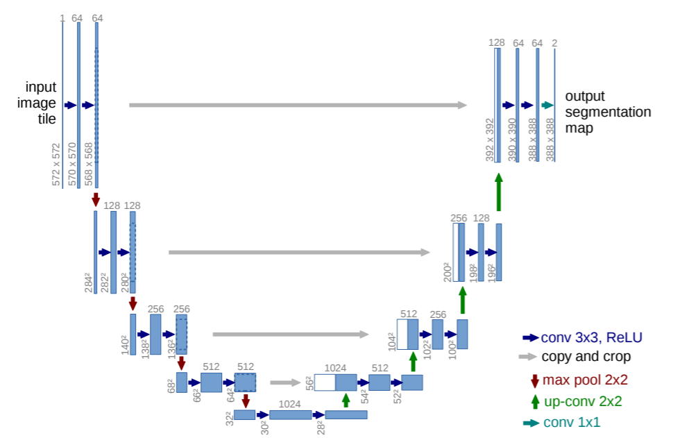
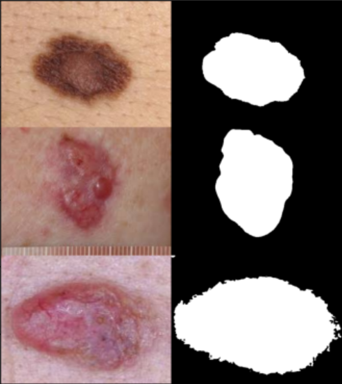
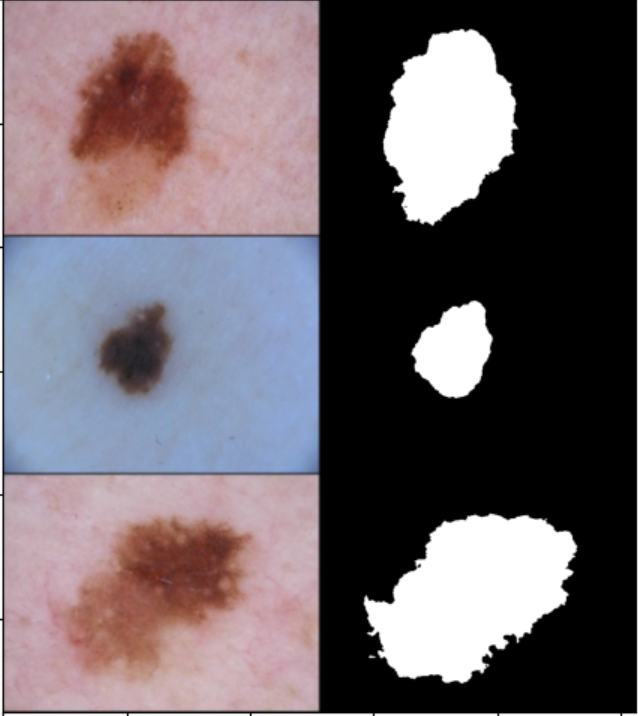

# Skin Lesion Segmentation

Implementation of U-Net / DoubleU-Net for lesion boundary Segmentation (ISIC 2018-task 1).

This implementation was integrated into VN AIDr - A medical image processing opensource. [Documentation](https://dr.vnopenai.org/vision/skin-lesion-segmentation/intro-and-data/).

## TODO

- [x] Build model U-Net.

- [x] Build model DoubleU-Net.

- [x] Write code for Dice loss.

- [x] Write code for Jaccard-index (mean Intersection of Union).

- [x] Augment data.

- [x] Implement training code and data-preprocessing code.

- [x] Implement demo code.

- [x] Convert model to onnx format.

- [x] Add pre-traind models.

## Preprequisites

* Install python 3.
* Install dependencies using requirements.txt by :  ```!pip install -r requirements.txt```.
* Download data from [ISIC2018_task1 Lesion Boundary Segmentation Challenge](https://challenge2018.isic-archive.com/).
* Pre-train model :[[link here]](https://drive.google.com/drive/folders/1cwNzf9OSG3PD_8MCeVobl04HystIbCSV?usp=sharing).

## Architecture
### 1. U-net

I modified architecture of U-Net to use with image size 192x256x3, the same size implemented in DoubleU-Net paper.



### 2,Double-net

DoubleU-Net includes two sub-networks, look alike two U-Net concatenated.

Input is fed into modified U-Net and then generate Output1. Output1 has the same size as input image.
The sub-network 2 is for fine-grained proposal. It was built from scratch with the same idea as U-Net. However, in the decoder of sub-network 2, skip_connection from encoder1 is fed into.

At the end the Output1 and Output2 was conatenated in channel axis. So we can get one of those for prediction.
In original paper, author showed that Output1 and Output2 had the same result.

.

## Training

### Data

There are two common ways to augment data:

- Offline augmentation: Generate augmented images before training.

- Online augmentation: Generate augmented images during training progress.

To reduce training time, I chosen the first way.

Download raw data from [5]. for your convenience, I splited, augmented data and stored in link [6]. Download and put them in the same folder with your code.

Your directory structure will be:

```
Unet-and-double-Unet-implementation
├──data_augmented
│    ├── mask/
│    ├── image/
├──validation
│    ├── mask/
│    ├── image/
├──image
│    ├── demo2.png
│    ├── demo3.png
│    ├── DoubleU-net_Architecture.png
│    ├── Unet_Architecture.png
├──.gitignore
├──README.md
├──data.py
├──metrics.py
├──model.py
├──predict.py
├──requirements.txt
├──train.py9
├──utils.py

###
```

Train your model:

```
!python train.py

```

Your model will be stored in folder `checkpoint` after every epoch.
I also provide pre-trained model in [7].

## Result 





## References: 

[1] Origin paper: [DoubleU-Net: A Deep Convolutional Neural
Network for Medical Image Segmentation](https://arxiv.org/pdf/2006.04868.pdf)

[2] ASPP block :[DeepLab: Semantic Image Segmentation with
Deep Convolutional Nets, Atrous Convolution,
and Fully Connected CRFs](https://arxiv.org/pdf/1606.00915v2.pdf)

[3] Squeeze-and-Excitation block: [Squeeze-and-Excitation Networks](https://arxiv.org/abs/1709.01507)

[4] [Repository 2020-CBMS-DoubleU-Net](https://github.com/DebeshJha/2020-CBMS-DoubleU-Net)

[5] Data: [ISIC2018_task1 Lesion Boundary Segmentaion ](https://challenge2018.isic-archive.com/)

[6] My data after augmented: [link here]()

[7] Pre-train model :[[link here]](https://drive.google.com/drive/folders/1cwNzf9OSG3PD_8MCeVobl04HystIbCSV?usp=sharing) 

## Contact 

If you find any mistakes in my work, please contact me, I am really grateful.

- **Pesonal email:** dovietchinh1998@gmail.com
- **VNOpenAI team:** vnopenai@gmail.com

Thanks for your interest!
